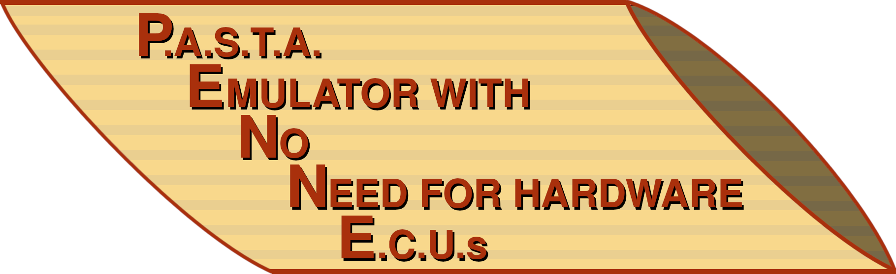

# PENNE - P.A.S.T.A Emulator with No Need for hardware E.C.U.s

This project is based on the [Toyota PASTA Framework](https://github.com/pasta-auto). The goal was to create a virtual instance of the testbed with possibilities to gradually improve the security of the system from a bare metal basis.

By providing a fully virtualized testbed, the financial burden for the purchase of a physical testbed is removed.

## Getting Started
To run the PASTA GUI, execute the **run.sh** script in the [/code/penne/](https://gitlab.tugraz.at/iti-pasta/pasta/-/tree/main/code/penne) directory.

The script builds the C project for the ECUs and tries to install the following packets with **apt**:
- cmake
- python3
- python3-virtualenv
- python3-pip
- libssl-dev
- libgtk-3-dev
- build-essential
- libsdl2-dev
- socat
- at-spi2-core

  
Then a virtual environment is created and the required Python packages are installed. After that, the virtual CAN interface is set up and the Python GUI is started.

The GUI itself starts the compiled binary for the 3 ECUs. The code for the ecu binary is located in `code/penne/penne_ecu/`.
