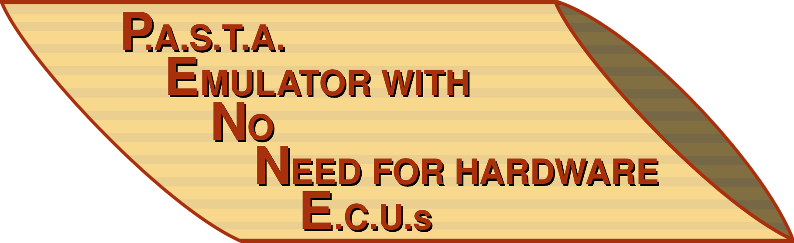
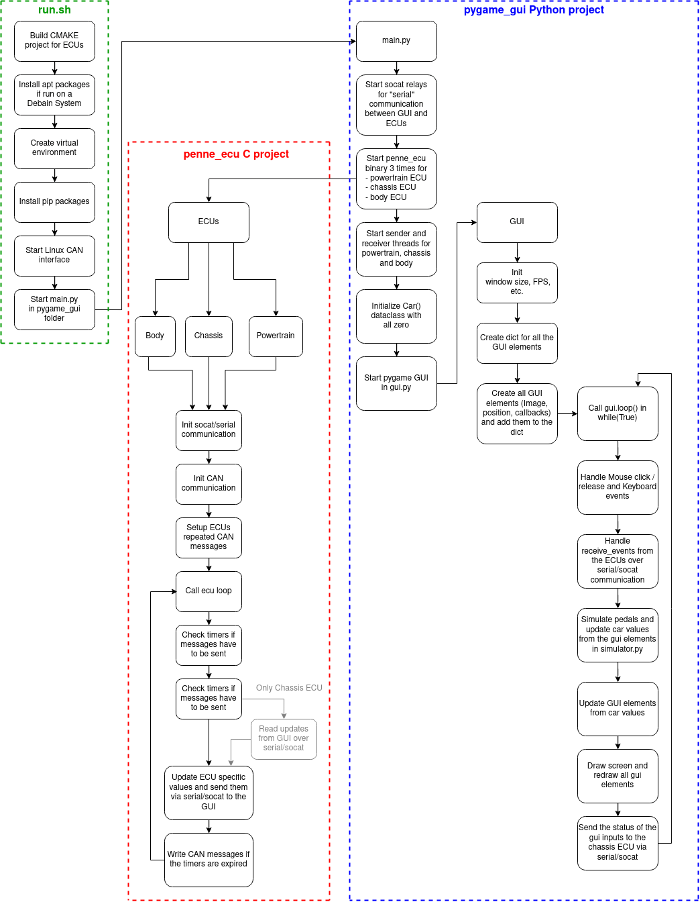

# PENNE - P.A.S.T.A Emulator with No Need for hardware E.C.U.s




The idea of this project was influenced the [Toyota PASTA Framework](https://github.com/pasta-auto). The goal was to create a virtual instance of the testbed with possibilities to gradually improve the security of the system from a bare metal basis.

By providing a fully virtualized testbed, the financial burden for the purchase of a physical testbed is removed.

## Getting Started
The following steps were tested on a fresh install of Debian12

First install git
```
sudo apt install git
```

Clone the Repository
```
git clone git@github.com:AstroTV/PENNE.git
```

Run the script to download the needed packages and execute the PENNE Testing Framework
```
cd PENNE
./run.sh
```


The script builds the C project for the ECUs and tries to install the following packets with **apt**:
- cmake
- python3
- python3-virtualenv
- python3-pip
- python3-tk
- libssl-dev
- libgtk-3-dev
- build-essential
- libsdl2-dev
- socat
- at-spi2-core

  
Then a virtual environment is created and the required Python packages are installed. After that, the virtual CAN interface is set up and the Python GUI is started.

The GUI itself starts the compiled binary for the 3 ECUs. The code for the ecu binary is located in `penne_ecu/`.

## Flowchart

Below, the flowchart of the project is provided:



## Contributions
Special thanks to Richard Heinz for the implementation of the Sniffing & Replay Attack and to Florian Kuppelwieser for the demonstrations on the Bluetooth controlled model vehicle.


